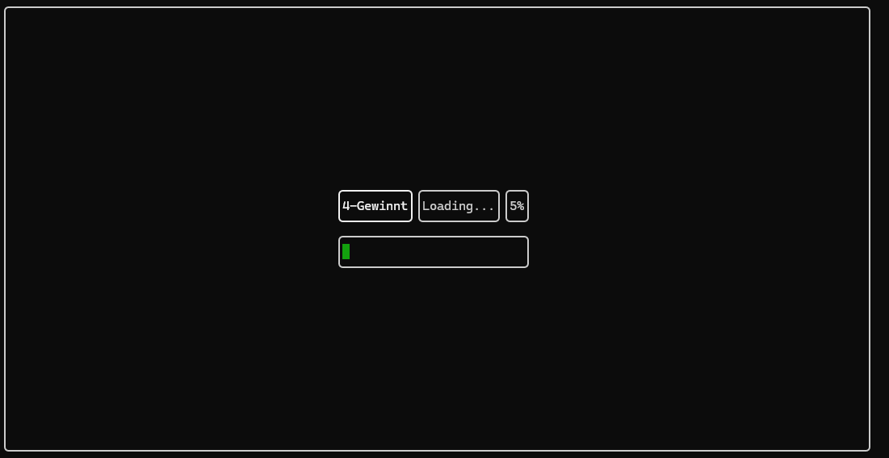
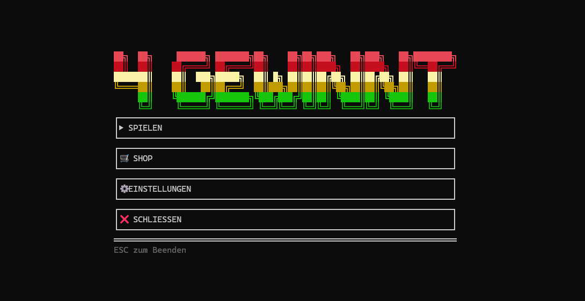

# 4-Gewinnt Client

Terminal-basierter Client für ein 4‑Gewinnt Spiel.
Benutzt FTXUI für die UI-Darstellung und WinMM für Sound.

## Voraussetzungen
- Windows 10 / 11
- CLion oder CMake + Visual Studio Build Tools (MSVC)
- CMake (>= 3.XX)
- Git

## Schnellstart (CLI)
1. Repository klonen:
```
git clone https://github.com/beklauter/4gewinnt_client.git
cd 4gewinnt_client
```

2. Build-Ordner anlegen und konfigurieren (Beispiel Visual Studio 2022):
```
cmake -S . -B cmake-build-release-visual-studio -G "Visual Studio 17 2022" -A x64 -DCMAKE_BUILD_TYPE=Release
```

3. Bauen:
```
cmake --build cmake-build-release-visual-studio --config Release --target 4gewinnt_client -j 10
```

4. Ausführen:
- Binary: `cmake-build-release-visual-studio/Release/4gewinnt_client.exe`  
- Oder in CLion öffnen und Run/Build benutzen.

## Wichtige Pfade
- Screenshots für die README: `assets/readme/loading_screen.png`, `assets/readme/main_menu.png`
- Quellcode: `src/`

## Hinweise
- Falls Probleme mit Windows-Headern (z.\,B. `min`/`max`) auftreten: Compiler-Definition `NOMINMAX` für das Target setzen.
- Für Sound wird `winmm.lib` verwendet (\#pragma oder CMake-Linker-Einstellung).

## Bei Fehlern oder Feature-Wünschen
- Einfach Issue erstellen oder Pull Request.

## Lizenz
- `MIT`

## Screenshots

